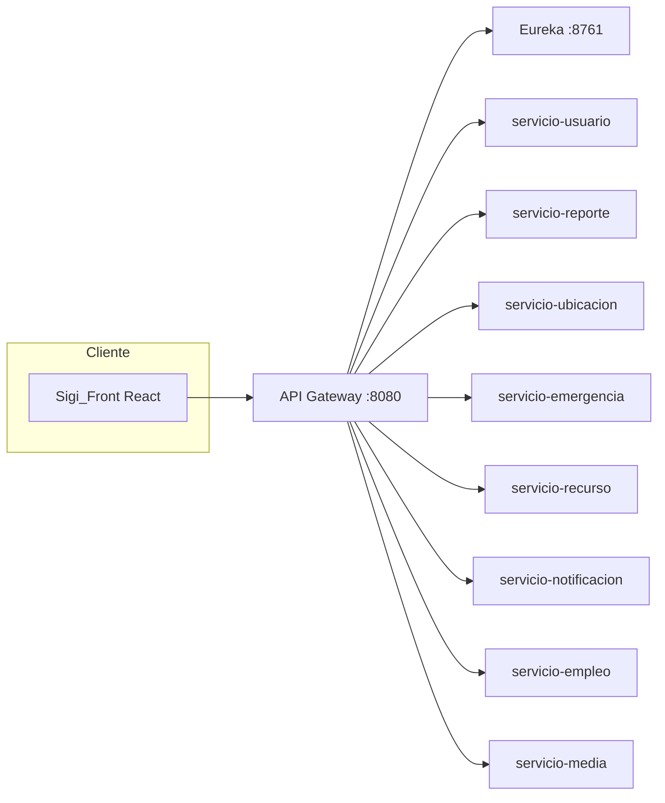

# INFORME TÉCNICO — PROYECTO INTEGRAL S.I.G.I.

**Municipalidad Valle del Sol — Gestión y prevención de emergencias**

| Campo | Dato |
|--------|------|
| Carrera | Ingeniería en Informática |
| Asignatura | Full Stack III / Arquitectura de Software *(ajustar según ramo)* |
| Integrantes | Hawk Durant, Emilio Jaramillo, Rodrigo Candia |
| Fecha | Mayo 2026 |
| Repositorio | `Proyecto-Municipalidad-Valle-del-Sol` |

---

## Índice

1. [Contexto](#1-contexto)
2. [Objetivos del proyecto](#2-objetivos-del-proyecto)
3. [Arquitectura general](#3-arquitectura-general)
4. [Backend — microservicios y funciones](#4-backend--microservicios-y-funciones)
5. [Frontend — componentes, servicios y hooks](#5-frontend--componentes-servicios-y-hooks)
6. [Seguridad y roles de usuario](#6-seguridad-y-roles-de-usuario)
7. [Flujos operativos principales](#7-flujos-operativos-principales)
8. [Pruebas realizadas](#8-pruebas-realizadas)
9. [Despliegue y ejecución](#9-despliegue-y-ejecución)
10. [Limitaciones y trabajo futuro](#10-limitaciones-y-trabajo-futuro)
11. [Conclusiones](#11-conclusiones)
12. [División del trabajo en el equipo](#12-división-del-trabajo-en-el-equipo)

---

## 1. Contexto

La Municipalidad Valle del Sol es un caso semestral ficticio, pero el problema que plantea es real: en muchas comunas los avisos de incendios, fugas de gas, rutas en mal estado o inundaciones llegan por WhatsApp, llamadas o redes sociales. Eso dificulta ordenar la información, asignar recursos y dejar un registro auditable.

La Subdirección de Gestión de Emergencias y Prevención de Desastres necesita una plataforma donde:

- Los **residentes** puedan registrarse, reportar emergencias con detalle y foto, ver el estado de sus reportes y acceder a información municipal (empleos, actividades).
- Los **operadores** de la central validen reportes y coordinen la respuesta.
- El **equipo de emergencia** (bomberos, brigadistas, paramédicos) actualice el estado de las emergencias activas.
- Los **administradores** tengan un dashboard, gestión de usuarios, mapa de incidentes y mantenimiento de avisos de empleo.

Nosotros tres (Hawk, Emilio y Rodrigo) desarrollamos **S.I.G.I.** (*Sistema Inteligente de Gestión de Incendios*), extendido después a otros tipos de emergencia. El sistema tiene **backend en microservicios** (Java/Spring) y **frontend en React** (Vite), unidos por un **API Gateway** con autenticación JWT.

Este informe documenta el proyecto **completo** (no solo backend): qué hace cada parte, por qué la implementamos así y qué aprendimos en el proceso.

---

## 2. Objetivos del proyecto

### 2.1 Objetivo general

Construir una aplicación web full stack que centralice el ciclo de vida de un reporte ciudadano: desde el aviso inicial hasta la validación, geolocalización, creación de emergencia, asignación de recursos y seguimiento por roles.

### 2.2 Objetivos específicos

| Objetivo | Cómo lo abordamos |
|----------|-------------------|
| Autenticación por roles | JWT en Gateway; roles: `CIUDADANO`, `OPERADOR_MUNICIPAL`, `EQUIPO_EMERGENCIA`, `ADMIN` |
| Reportes con ubicación | `servicio-reporte` + geocodificación vía `servicio-ubicacion` (OpenCage con caché) |
| Evidencia fotográfica | `servicio-media` guarda archivos; el reporte y el perfil guardan `fotoMediaId` |
| Empleos y postulaciones | `servicio-empleo` con avisos y postulaciones por usuario |
| Interfaz usable para el curso | React con `useState`, `useEffect` y patrón loading/error/datos |
| Despliegue reproducible | Docker Compose con MySQL, Eureka y todos los servicios |
| Calidad mínima verificable | JUnit en backend, Jest en frontend |

---

## 3. Arquitectura general

El cliente (navegador con React) **solo habla con el puerto 8080** del API Gateway. Eureka registra los microservicios; el Gateway y OpenFeign resuelven nombres como `lb://servicio-reporte` sin IP fijas.



**Principio database per service:** cada microservicio tiene su base (`db_usuario`, `db_reporte`, etc.). En desarrollo usamos **un contenedor MySQL** con varias bases creadas por script, para no exigir seis servidores en el notebook.

| Servicio | Puerto | Base de datos | Responsabilidad principal |
|----------|--------|---------------|---------------------------|
| eureka | 8761 | — | Registro de instancias |
| api-gateway | 8080 | — | Ruteo, JWT, cabeceras de identidad |
| servicio-usuario | 8081 | db_usuario | Registro, login, JWT, perfil |
| servicio-reporte | 8082 | db_reporte | Reportes ciudadanos |
| servicio-ubicacion | 8083 | db_ubicacion | Geocodificación + caché |
| servicio-emergencia | 8084 | db_emergencia | Ciclo de vida de emergencias |
| servicio-recurso | 8085 | db_recurso | Camiones y brigadas |
| servicio-notificacion | 8086 | db_notificacion | Alertas registradas |
| servicio-empleo | 8087 | db_empleo | Avisos laborales y postulaciones |
| servicio-media | 8088 | db_media | Subida y descarga de imágenes |

---

## 4. Backend — microservicios y funciones

En esta sección explicamos las **clases y métodos que nos importaron** para entender el sistema. No listamos cada getter de Lombok; nos centramos en la lógica de negocio.

### 4.1 API Gateway — `JwtAuthGatewayFilterFactory`

| Elemento | Qué hace | Por qué existe |
|----------|----------|----------------|
| `apply(Config)` | Devuelve un filtro que se ejecuta en cada petición protegida | Es la forma estándar de Spring Cloud Gateway para filtros custom |
| Lectura de `Authorization: Bearer` | Extrae el JWT del header | El frontend guarda el token tras el login |
| `validateToken(token)` | Verifica firma y expiración con `JWT_SECRET` | Misma clave que `servicio-usuario` al firmar |
| Cabeceras `X-User-Id`, `X-User-Role`, `X-User-Name` | Las inyecta en la petición hacia el microservicio | Los servicios no re-decodifican el JWT; confían en el Gateway *(válido en demo académica)* |

Si el token falta o es inválido, respondemos **401** y no llegamos al microservicio.

### 4.2 servicio-usuario

**`AuthController`**

- `registrar(UsuarioRegistroDTO)` — Crea cuenta. Validamos con `@Valid` y devolvemos 201 o 400 si el email ya existe.
- `login(LoginDTO)` — Devuelve `AuthResponseDTO` con token, rol y `usuarioId`. Lo usamos en el frontend para rutas y permisos.

**`UsuarioService`**

- `registrar` — Hashea la contraseña con **BCrypt** antes de guardar. Nunca persistimos texto plano.
- `login` — Compara con `passwordEncoder.matches`, verifica que la cuenta esté activa y genera JWT con `JwtUtil` (claims `userId` y `role`).
- `actualizarFotoPerfil` — Guarda `fotoMediaId` que antes subió el usuario a `servicio-media`.

**`UsuariosPruebaInitializer`** (CommandLineRunner)

- Al arrancar, crea si no existen los usuarios de Hawk, Emilio y Rodrigo con contraseñas conocidas. Nos ahorra registrarlos a mano en cada demo.

### 4.3 servicio-reporte

**`ReporteService.crearReporte`**

1. Llama a `UbicacionConsultaService` (Feign + circuit breaker) para obtener lat/lon.
2. Arma la entidad `Reporte` en estado `PENDIENTE`.
3. Si el frontend envió `fotoMediaId`, lo guardamos para enlazar la evidencia.

**`listarMisReportes`** — Un ciudadano solo ve los suyos; operador y admin pueden consultar por `usuarioId` en la ruta.

**`listarPendientes`** — Cola para la central (Emilio en las pruebas).

**`listarTodos`** — Solo admin/operador; alimenta el dashboard de Rodrigo.

**`validar`** — Si `aprobado == true`, pasa a `VALIDADO` y llama a `EmergenciaClient.crearDesdeReporte` para abrir el caso operativo. Si no, `RECHAZADO` con notas del operador.

### 4.4 servicio-ubicacion

**`UbicacionService.obtenerCoordenadas`**

- Consulta OpenCage con la dirección del reporte.
- Guarda resultado en caché MySQL para no gastar cuota de API ni demorar reportes repetidos en la misma calle.
- Si OpenCage falla, el circuit breaker permite que el reporte **igual se guarde** sin coordenadas (decisión explícita: mejor perder el mapa que perder el aviso).

### 4.5 servicio-emergencia

**`EmergenciaService.crearDesdeReporteValidado`** — Instancia una emergencia ligada al `reporteId`.

**`actualizarEstado`** — Lo usa el equipo de emergencia desde el frontend (`/emergencias`) para pasar de `ACTIVA` a `EN_PROCESO`, `CONTROLADA`, `RESUELTA`, etc.

### 4.6 servicio-recurso

**`RecursoService.asignarAutomaticamente`** — Según prioridad del reporte, busca un recurso disponible (camión cisterna, brigada) y lo marca ocupado. Los datos de ejemplo mencionan nuestros nombres en las observaciones de los camiones (detalle de demo).

### 4.7 servicio-notificacion

**`NotificacionService.crearAlertaPorEmergencia`** — Cuando se valida un reporte, registra notificaciones asociadas al evento. En producción irían a push/SMS; aquí dejamos trazabilidad en BD.

### 4.8 servicio-empleo

**`EmpleoService`**

| Método | Función |
|--------|---------|
| `listarActivos` | Avisos visibles para cualquier usuario autenticado |
| `crear` / `actualizar` / `eliminar` | CRUD restringido a rol `ADMIN` en el controller |
| `postular` | Crea `Postulacion` si el usuario no había postulado antes |
| `misPostulaciones` | Historial del ciudadano |

**`DatosEjemploEmpleos`** — Carga tres avisos iniciales al primer arranque (brigadista, operador SIGI, admin TI).

### 4.9 servicio-media

**`MediaService.subir`**

- Recibe `MultipartFile`, genera nombre UUID en disco (`/app/uploads` en Docker con volumen persistente).
- Persiste metadatos en `media_archivos` (tipo `REPORTE` o `PERFIL`, `usuarioId`, etc.).

**`obtenerArchivo`** — Sirve el binario para que el frontend muestre la imagen en ``.

**Por qué un servicio aparte:** las fotos no deberían ir en Base64 dentro del JSON del reporte; ensucia la API y pesa en MySQL. Separar media nos permitió límite de 10 MB y reutilizar la misma lógica para perfil y reporte.

---

## 5. Frontend — componentes, servicios y hooks

Stack: **React 19**, **Vite**, **Tailwind CSS**, **React Router**. Conectamos al backend vía proxy de Vite (`/api` y `/auth` hacia `localhost:8080`).

### 5.1 Capa de servicios (`src/services/`)

| Archivo / función | Qué hace | Por qué |
|-------------------|----------|---------|
| `apiClient.apiFetch` | `fetch` con JSON, adjunta `Authorization` desde `localStorage` | Punto único para errores HTTP y token |
| `apiClient.apiUpload` | `fetch` multipart **sin** `Content-Type: application/json` | Subir imágenes correctamente |
| `apiClient.mediaUrl` | Prefija la URL base al path `/api/media/...` | Las rutas del backend son relativas |
| `authService.login` / `registro` | POST a `/auth/login` y `/auth/registro` | Separar auth del resto de APIs |
| `reporteService.*` | CRUD de reportes según rol | Una función por endpoint del backend |
| `empleoService.*` | Listado, postulación, admin CRUD | Reemplaza el mock local que teníamos al inicio |
| `mediaService.subirImagen` | Arma `FormData` con `file` y `tipo` | Encapsula la subida antes de crear reporte o perfil |

### 5.2 Contexto de autenticación — `AuthContext.jsx`

| Función / estado | Rol |
|------------------|-----|
| `auth` | Objeto con `token`, `rol`, `usuarioId`, `email` |
| `login(email, password)` | Llama API, guarda sesión, propaga error en UI |
| `logout` | Limpia `localStorage` y estado |
| `esAdmin`, `esOperador`, `esEquipo` | Helpers para menú y rutas |
| `rutaInicio` | Ciudadano va a `/inicio`, operador/admin a `/dashboard` |

Usamos **Context** para no pasar el token en props por diez niveles. En un proyecto más grande evaluaríamos React Query para el cache de listas.

### 5.3 Patrón del curso: loading, error, datos

En `MisReportes`, `Dashboard`, `Empleos` y `Emergencias` repetimos el mismo esquema que vimos en Full Stack III con TMDB:

```text
const [data, setData] = useState([]);
const [loading, setLoading] = useState(true);
const [error, setError] = useState(null);

useEffect(() => { cargarDesdeApi(); }, [dependencia]);
```

**Por qué:** el usuario siempre debe ver si está cargando, si falló la red o si la lista llegó vacía. No mezclamos eso con la lógica de render de las tarjetas.

### 5.4 Componentes principales

| Componente | Responsabilidad |
|------------|-----------------|
| `ReporteIncendioCard` | Tarjeta del desafío Municipalidad: nivel de riesgo, sector, botón “Atendido” con estado local |
| `ProtectedRoute` | Redirige a `/login` si no hay token; valida `roles` opcionales |
| `Layout` | Barra de navegación según rol del usuario logueado |
| `MapaIncidentes` | Iframe OpenStreetMap con bbox calculado desde coordenadas de reportes/emergencias |
| `Spinner` / `ErrorMessage` | Feedback visual reutilizable |

### 5.5 Páginas por rol

| Ruta | Usuario típico | Función |
|------|----------------|---------|
| `/login`, `/registro` | Público | Acceso y alta de ciudadanos |
| `/inicio` | Ciudadano | Hub con accesos rápidos |
| `/nuevo-reporte` | Ciudadano | Sube foto a media, luego POST reporte con `fotoMediaId` |
| `/mis-reportes` | Ciudadano | Historial con filtro pendientes/resueltos |
| `/empleos` | Todos | Lista avisos; postular; admin crea/desactiva |
| `/actividades` | Todos | Calendario municipal *(datos locales de demo)* |
| `/perfil` | Todos | Foto de perfil vía media + `PUT /api/usuarios/me/foto` |
| `/dashboard` | Operador / Admin | Estadísticas, validación, mapa (admin) |
| `/reportes` | Operador | Cola con filtro por riesgo; simulación cada 5 s en modo demo |
| `/emergencias` | Operador / Equipo | Cambio de estado de emergencias activas |
| `/usuarios` | Admin | Listado y desactivación soft |

### 5.6 Utilidades — `reporteMappers.js`

**`reporteApiACard(reporte)`** — Convierte la respuesta del backend (`prioridad: CRITICA`, `direccion`) al formato de la tarjeta del trabajo de clases (`nivelRiesgo: 'crítico'`, `sector`). Así reutilizamos el componente del desafío sin mentir con datos hardcodeados cuando hay API.

### 5.7 Constantes — `usuariosPrueba.js`

Centraliza emails y roles de Hawk, Emilio y Rodrigo. La pantalla de login tiene botones que rellenan el formulario para las correcciones en vivo sin typos.

---

## 6. Seguridad y roles de usuario

| Rol | Permisos en la práctica |
|-----|-------------------------|
| `CIUDADANO` | Crear reportes, ver los propios, postular a empleos, subir fotos |
| `OPERADOR_MUNICIPAL` | Validar reportes, ver colas, emergencias, dashboard |
| `EQUIPO_EMERGENCIA` | Leer y actualizar estado de emergencias *(mismo frontend que operador en rutas compartidas)* |
| `ADMIN` | Todo lo anterior + mapa global, CRUD empleos, listar/desactivar usuarios |

La autorización fina en microservicios es **básica** (revisamos `X-User-Role` en algunos endpoints). El Gateway es el guardián principal. Para producción habría que endurecer cada servicio.

**Usuarios de prueba (semilla al arrancar backend):**

| Persona | Email | Rol |
|---------|-------|-----|
| Hawk Durant | hawk.durant@test.com | CIUDADANO |
| Emilio Jaramillo | emilio.jaramillo@municipalidad.cl | OPERADOR_MUNICIPAL |
| Rodrigo Candia | rodrigo.candia@municipalidad.cl | ADMIN |

---

## 7. Flujos operativos principales

### 7.1 Reporte con foto (ciudadano)

1. Login → token en `localStorage`.
2. En **Nuevo reporte**, el usuario completa tipo, descripción, dirección y prioridad.
3. Si adjunta imagen: `POST /api/media/upload` → recibe `id`.
4. `POST /api/reportes` con `fotoMediaId`.
5. Backend geocodifica dirección (o guarda sin GPS si falla ubicación).
6. El reporte queda `PENDIENTE`; el ciudadano lo ve en **Mis reportes** con la foto servida por `/api/media/{id}/archivo`.

### 7.2 Validación y emergencia (operador)

1. Emilio entra al **Dashboard** o **Cola reportes**.
2. `GET /api/reportes/pendientes`.
3. `PUT /api/reportes/{id}/validar` con `aprobado: true` y notas.
4. El backend crea emergencia, asigna recurso y dispara notificaciones vía Feign.

### 7.3 Postulación a empleo

1. Hawk entra a **Empleos** → `GET /api/empleos`.
2. `POST /api/empleos/{id}/postular`.
3. El sistema impide doble postulación al mismo aviso.

---

## 8. Pruebas realizadas

### 8.1 Backend

- **JUnit 5 + Mockito** en servicios críticos (`ReporteService`, `UsuarioService`, `NotificacionService`, etc.).
- Prueba de contexto Spring (`@SpringBootTest`) por microservicio.

### 8.2 Frontend

- **Jest** + Testing Library: login, registro, `ReporteIncendioCard`, mappers, servicios `empleo` y `media` con mocks de `apiFetch`.
- Comando: `npm test` en `Sigi_Front/` (12 tests al cierre de este informe).

Las pruebas E2E con navegador automatizado no las alcanzamos a implementar; las dejamos como mejora.

---

## 9. Despliegue y ejecución

```bash
# Backend (desde sigi-backend/)
docker compose up --build

# Frontend (desde Sigi_Front/)
npm install
npm run dev
```

- Gateway: http://localhost:8080  
- Frontend: http://localhost:5173  
- Eureka: http://localhost:8761  
- MySQL en host: puerto **13306** (para no chocar con un MySQL local en 3306)

Variables relevantes: `JWT_SECRET` (igual en gateway y usuario), `OPENCAGE_API_KEY` (opcional, mejora mapas), volumen `media-uploads` para fotos.

---

## 10. Limitaciones y trabajo futuro

1. **Actividades municipales** siguen en `localStorage` del frontend; no tienen microservicio propio todavía.
2. **Autorización** no está reforzada en todos los endpoints internos; confiamos mucho en el Gateway.
3. **Notificaciones** se guardan en BD pero no llegan push/email al vecino.
4. **Registro** pide certificado de residencia en el formulario HTML, pero el backend aún no valida ese documento.
5. Si MySQL ya existía sin `db_empleo` / `db_media`, hay que crear las bases manualmente o reiniciar el volumen de Docker.
6. El panel de Eureka muestra IPs internas que desde el navegador del host a veces no abren; la forma correcta de probar es siempre el **Gateway en 8080**.

---

## 11. Conclusiones

Logramos entregar una plataforma coherente con el enunciado del caso semestral: residentes reportan con evidencia, la municipalidad valida y coordina, y cada rol tiene pantallas acotadas. La arquitectura de microservicios nos costó más configuración (Eureka, Docker, Feign), pero nos permitió explicar en la defensa conceptos de **bounded context**, **API Gateway**, **resiliencia** (circuit breaker en ubicación) y **separación de datos**.

En frontend aplicamos de forma real lo visto en Full Stack III: componentes reutilizables, estado local e independiente por tarjeta, efectos para cargar APIs y simular tiempo real en la cola de reportes. Conectar React al Gateway nos obligó a manejar JWT, multipart y errores HTTP de manera explícita, no solo con datos falsos en memoria.

Como equipo nos quedó claro que el valor del sistema no está solo en “tener muchos servicios”, sino en **trazar el reporte de punta a punta**. Los siguientes pasos naturales serían notificaciones reales, microservicio de actividades, pruebas E2E y endurecer seguridad en cada capa.

---

## 12. División del trabajo en el equipo

Distribución aproximada según lo que cada uno fue llevando en el repo (no es rígido; nos reunimos para integrar):

| Integrante | Aportes principales |
|------------|---------------------|
| **Hawk Durant** | Flujo ciudadano: registro, login, nuevo reporte con foto, mis reportes, empleos/postulación; pruebas Jest de login y servicios |
| **Emilio Jaramillo** | Flujo operador: cola de reportes, validación, página de emergencias, coordinación con backend de `servicio-emergencia` y `servicio-reporte` |
| **Rodrigo Candia** | Dashboard admin, mapa de incidentes, gestión de usuarios, CRUD de empleos; seeder de usuarios de prueba; documentación Docker y Gateway |

La integración final (conexión frontend–backend, `servicio-empleo`, `servicio-media`) la hicimos en conjunto revisando CORS, proxy de Vite y rutas del Gateway.

---

*Informe elaborado por Hawk Durant, Emilio Jaramillo y Rodrigo Candia — Proyecto S.I.G.I., Municipalidad Valle del Sol, 2026.*
