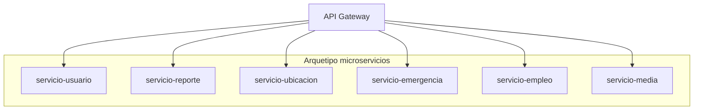
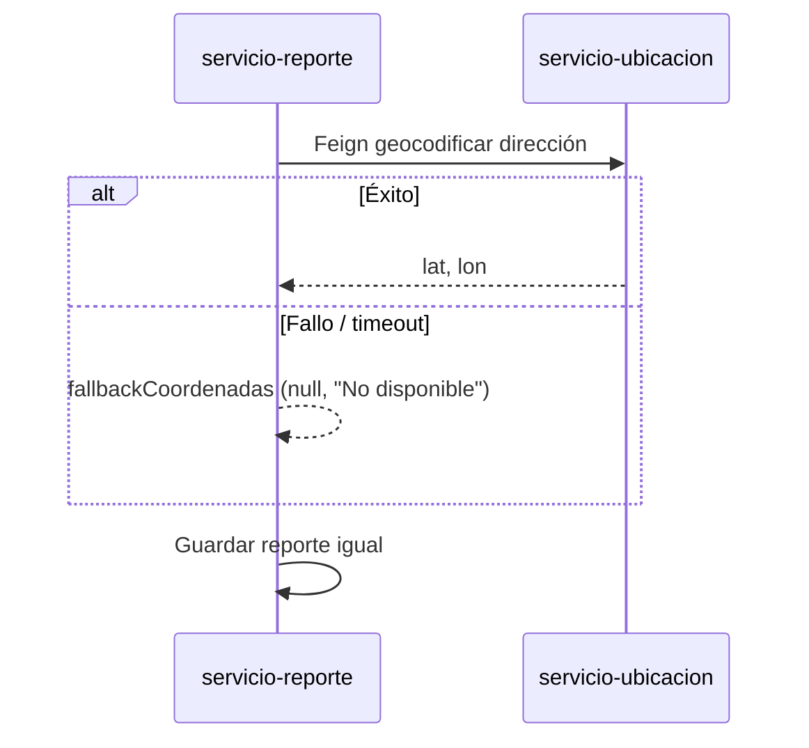

# Análisis de Patrones de Diseño y Arquetipos

**Proyecto:** S.I.G.I. — Municipalidad Valle del Sol  
**Integrantes:** Hawk Durant, Emilio Jaramillo, Rodrigo Candia  
**Asignatura / entrega:** Documentación de arquitectura (Duoc UC)  
**Fecha:** Mayo 2026  

---

> **Exportar a PDF:** Abrir este archivo en Visual Studio Code o Word → *Archivo > Imprimir > Guardar como PDF*, o usar Pandoc:  
> `pandoc docs/ANALISIS_PATRONES_Y_ARQUETIPOS.md -o docs/ANALISIS_PATRONES_Y_ARQUETIPOS.pdf --toc`

---

## 1. Introducción

Este documento describe los **patrones de diseño** y **arquetipos arquitectónicos** que usamos en el proyecto S.I.G.I. No los aplicamos “por catálogo”, sino porque cada uno resolvía un problema concreto: separar responsabilidades, proteger el sistema ante fallos externos, o mantener el frontend legible cuando conectamos APIs reales.

El alcance cubre **backend** (microservicios Spring) y **frontend** (React), ya que la entrega es full stack.

---

## 2. Resumen ejecutivo

| Categoría | Patrones / arquetipos principales |
|-----------|-----------------------------------|
| Arquitectura | Microservicios, API Gateway, Service Discovery, Database per Service |
| Backend (estructural) | Capas (Controller – Service – Repository), DTO |
| Backend (comportamiento) | Circuit Breaker, cliente declarativo (OpenFeign) |
| Backend (creacional) | Singleton (beans Spring), Factory Method (filtro Gateway) |
| Seguridad | JWT stateless, filtro en Gateway |
| Frontend | Componentización, Context Provider, capa de servicios HTTP, estado loading/error/datos |
| Pruebas | Mock en unit tests (Mockito / Jest) |

---

## 3. Arquetipos arquitectónicos

### 3.1 Estilo: microservicios

**Qué es:** El sistema se divide en servicios desplegables por separado, cada uno con responsabilidad de negocio acotada (usuarios, reportes, ubicación, etc.).

**Por qué lo elegimos:**

- El caso semestral y la asignatura de arquitectura pedían demostrar **fronteras claras** entre módulos.
- Permite escalar o fallar de forma parcial (si cae geocodificación, el reporte puede guardarse igual).
- Nos facilitó repartir trabajo: cada integrante pudo enfocarse en un flujo (ciudadano, operador, admin) sobre APIs distintas.

**Trade-off que asumimos:** más complejidad operativa (Eureka, Docker Compose, varios puertos). Para el tamaño del equipo (tres personas) un monolito modular hubiera sido más simple; priorizamos el **argumento arquitectónico** defendible en presentación oral.



### 3.2 API Gateway (fachada de entrada)

**Qué es:** Un único punto HTTP (`:8080`) que enruta hacia los microservicios internos.

**Por qué:**

- El navegador no necesita conocer diez puertos distintos.
- Centralizamos **validación JWT** y propagamos identidad con cabeceras (`X-User-Id`, `X-User-Role`).
- Alineado con el patrón **Gateway** de microservicios (Chris Richardson).

**Implementación:** `api-gateway` con Spring Cloud Gateway y filtro `JwtAuthGatewayFilterFactory`.

### 3.3 Service Discovery (Eureka)

**Qué es:** Los servicios se registran al arrancar; el Gateway resuelve `lb://servicio-reporte` dinámicamente.

**Por qué:** En Docker las IPs internas cambian. Eureka evita hardcodear hosts en el YAML del Gateway.

### 3.4 Database per Service

**Qué es:** Cada microservicio persiste en su propia base lógica (`db_usuario`, `db_reporte`, `db_empleo`, `db_media`, etc.).

**Por qué:** Respeta el principio de **datos dueños del servicio**. En local usamos una sola instancia MySQL con varias bases (decisión pragmática de curso, documentada en el informe técnico).

### 3.5 Arquetipo de capas (por microservicio)

Dentro de cada servicio Spring repetimos:

| Capa | Responsabilidad | Ejemplo |
|------|-----------------|---------|
| **Controller** | HTTP, validación de entrada, códigos de estado | `ReporteController`, `EmpleoController` |
| **Service** | Reglas de negocio, transacciones | `ReporteService.validar` |
| **Repository** | Acceso a datos JPA | `ReporteRepository` |
| **Model / Entity** | Tablas | `Reporte`, `Empleo` |
| **DTO** | Contrato hacia fuera | `ReporteResponse`, `CrearReporteRequest` |

**Por qué:** Es el arquetipo que más domina el equipo con Spring Boot; separa “cómo llega el JSON” de “qué hacemos con él”.

### 3.6 SPA + backend desacoplado (frontend)

**Qué es:** `Sigi_Front` es una Single Page Application en React que consume REST vía Gateway.

**Por qué:** Permite roles distintos en la misma app cambiando rutas y menú según JWT, sin recargar páginas completas del servidor.

---

## 4. Patrones de diseño — Backend

### 4.1 Singleton (implícito en Spring)

**Dónde:** Beans anotados con `@Service`, `@Component`, `@Repository`.

**Qué hace:** Spring crea **una instancia** por contexto de aplicación y la reutiliza (inyección de dependencias).

**Justificación:** Evita instanciar manualmente servicios y facilita testing con `@MockBean`.

**Ejemplo en código:** `UsuarioService`, `ReporteService`, `MediaService`.

---

### 4.2 Repository (GoF + Spring Data JPA)

**Dónde:** Interfaces que extienden `JpaRepository<Entity, Long>`.

**Qué hace:** Abstrae SQL/CRUD; métodos como `findByUsuarioIdOrderByFechaReporteDesc` se generan por convención de nombres.

**Justificación:** No mezclamos consultas SQL en los controladores. Cumple el principio de **única responsabilidad**.

**Ejemplo:** `ReporteRepository`, `PostulacionRepository`, `MediaArchivoRepository`.

---

### 4.3 DTO (Data Transfer Object)

**Dónde:** Paquetes `dto` en cada microservicio (`ReporteResponse`, `UsuarioRegistroDTO`, `MediaResponse`).

**Qué hace:** Transporta solo los campos que el cliente debe ver; **nunca** enviamos la contraseña hasheada en respuestas.

**Justificación:**

- Desacopla el modelo de persistencia (JPA) del contrato REST.
- Permite evolucionar la entidad sin romper el frontend si el DTO se mantiene estable.

**Ejemplo:** `UsuarioResponseDTO.fromEntity(Usuario)` — método estático de mapeo que usamos en lugar de un mapper externo por simplicidad.

---

### 4.4 Factory Method — Gateway Filter Factory

**Dónde:** `JwtAuthGatewayFilterFactory extends AbstractGatewayFilterFactory`.

**Qué hace:** Spring Cloud Gateway registra el filtro bajo el nombre `JwtAuth` en `application.yml` (convención: quita el sufijo `GatewayFilterFactory`).

**Justificación:** Encapsula la creación del filtro de autenticación; el YAML solo declara `- JwtAuth` sin instanciar clases manualmente.

---

### 4.5 Facade (API Gateway)

**Dónde:** Módulo `api-gateway`.

**Qué hace:** Presenta una interfaz simple (`/api/reportes`, `/auth/login`) ocultando la topología interna de microservicios.

**Justificación:** Reduce acoplamiento del cliente respecto a puertos 8081–8088.

---

### 4.6 Proxy / Cliente declarativo — OpenFeign

**Dónde:**

- `UbicacionClient` en servicio-reporte
- `EmergenciaClient` en servicio-reporte
- `RecursoFeignClient`, `NotificacionFeignClient` en servicio-emergencia

**Qué hace:** Interface Java con anotaciones; Spring genera el cliente HTTP hacia otro microservicio registrado en Eureka.

**Justificación:** Evita escribir `RestTemplate` repetitivo y mantiene las llamadas entre servicios **tipadas**.

---

### 4.7 Circuit Breaker (Resilience4j)

**Dónde:** `UbicacionConsultaService.obtenerCoordenadas` con `@CircuitBreaker(name = "ubicacion", fallbackMethod = "fallbackCoordenadas")`.

**Qué hace:** Si el servicio de ubicación u OpenCage fallan repetidamente, ejecuta **fallback** y devuelve coordenadas nulas con mensaje `"No disponible"`.

**Justificación:** Un reporte ciudadano **no debe perderse** porque la API externa de mapas no respondió. Es degradación controlada (patrón relacionado: **Graceful degradation**).



---

### 4.8 Strategy (variante ligera — roles)

**Dónde:** Comprobaciones `if ("ADMIN".equals(rol))` en controladores (`EmpleoController`, `ReporteController`).

**Qué hace:** Cambia el comportamiento del endpoint según el rol sin duplicar controladores enteros.

**Justificación:** Para el alcance académico bastó con ramas explícitas; en producción evaluaríamos Spring Security method-level o políticas centralizadas.

---

### 4.9 CommandLineRunner / Seed de datos

**Dónde:** `UsuariosPruebaInitializer`, `DatosEjemploEmpleos`, `DatosEjemploValleDelSol` (recursos).

**Qué hace:** Al iniciar el contexto, inserta datos demo si la tabla está vacía.

**Justificación:** Correcciones y demos con usuarios conocidos (Hawk, Emilio, Rodrigo) sin scripts SQL manuales cada vez.

---

### 4.10 Soft Delete

**Dónde:** `UsuarioService.desactivarUsuario` — marca `activo = false` en lugar de `DELETE` físico.

**Justificación:** Trazabilidad y posibilidad de auditoría municipal; patrón común en sistemas administrativos.

---

## 5. Patrones de diseño — Frontend (React)

### 5.1 Componentización (Composite)

**Dónde:** `ReporteIncendioCard`, `Layout`, `Spinner`, `MapaIncidentes`.

**Qué hace:** Divide la UI en piezas reutilizables con props.

**Justificación:** Trabajo de Full Stack III (desafío Municipalidad) y mantenibilidad; evita duplicar HTML de cada reporte.

---

### 5.2 Container / Presentational (flexible)

**Dónde:**

- **Contenedores:** páginas en `src/pages/` (`Dashboard`, `MisReportes`) — cargan datos, manejan `useEffect`.
- **Presentacionales:** `ReporteIncendioCard`, `Spinner` — reciben props y renderizan.

**Justificación:** Separa lógica de fetching de la visual; facilita tests de tarjetas sin mockear toda la API.

---

### 5.3 Provider (Context API)

**Dónde:** `AuthProvider` + hook `useAuth`.

**Qué hace:** Comparte sesión (token, rol, `usuarioId`) en todo el árbol sin prop drilling.

**Justificación:** Casi todas las rutas protegidas necesitan saber quién está logueado.

---

### 5.4 Módulo de servicios (capa de acceso a datos)

**Dónde:** `src/services/apiClient.js`, `authService.js`, `reporteService.js`, `empleoService.js`, `mediaService.js`.

**Qué hace:** Centraliza URLs y formato de peticiones (JSON vs `multipart`).

**Justificación:** Si cambia el Gateway o un path, se toca un solo archivo. `apiUpload` existe porque subir imágenes **no** debe usar `Content-Type: application/json`.

---

### 5.5 Patrón loading / error / data (async UI)

**Dónde:** `MisReportes`, `Empleos`, `Dashboard`, `Emergencias`.

**Qué hace:**

```text
loading === true  → Spinner
error !== null    → ErrorMessage + reintentar
datos listos      → render lista
```

**Justificación:** Requisito explícito del curso Full Stack III; evita pantallas en blanco cuando el backend tarda o falla.

---

### 5.6 Estado derivado (sin useEffect innecesario)

**Dónde:** `reportesFiltrados = reportes.filter(...)` en `Reportes.jsx`; contadores en dashboard.

**Qué hace:** Calcula listas filtradas en render a partir de estado existente.

**Justificación:** El profesor enfatizó no duplicar estado que se puede derivar; menos bugs de sincronización.

---

### 5.7 Mapper / Adapter

**Dónde:** `reporteApiACard` en `reporteMappers.js`.

**Qué hace:** Adapta respuesta API (`prioridad: CRITICA`) al formato de tarjeta del trabajo de clases (`nivelRiesgo: 'crítico'`).

**Justificación:** Reutilizamos el componente del desafío sin mentir con datos hardcodeados cuando hay API real.

---

### 5.8 Protected Route (guard de navegación)

**Dónde:** `ProtectedRoute.jsx` + rutas en `App.jsx` con `roles={[...]}`.

**Qué hace:** Redirige a login si no hay token; bloquea rutas admin a ciudadanos.

**Justificación:** Seguridad UX alineada con roles del JWT (la seguridad real sigue en el Gateway).

---

## 6. Tabla de trazabilidad: problema → patrón

| Problema | Patrón / arquetipo | Ubicación |
|----------|-------------------|-----------|
| Muchos servicios y puertos | API Gateway + Eureka | `api-gateway`, `eureka` |
| Contraseñas en BD | BCrypt + DTO sin password | `UsuarioService` |
| OpenCage caído | Circuit Breaker + fallback | `UbicacionConsultaService` |
| JWT en cada servicio | Filtro centralizado Gateway | `JwtAuthGatewayFilterFactory` |
| Fotos grandes en JSON | Microservicio media + disco | `servicio-media` |
| UI repetitiva de reportes | Componente `ReporteIncendioCard` | `Sigi_Front` |
| Sesión en toda la app | Context `AuthProvider` | `AuthContext.jsx` |
| Empleos desacoplados de incendios | Microservicio `servicio-empleo` | `db_empleo` |

---

## 7. Patrones considerados y descartados

| Patrón | Motivo de descarte |
|--------|-------------------|
| CQRS completo | Demasiado peso para el plazo; lecturas y escrituras en el mismo modelo JPA |
| Event Sourcing | No necesitamos replay histórico de eventos en la demo |
| BFF por cliente | Un solo frontend web; el Gateway alcanza |
| Redux global | Context + estado local bastó para el tamaño de la app |
| GraphQL | El curso y el backend ya estaban en REST |

---

## 8. Conclusión del análisis

El proyecto combina un **arquetipo de microservicios** con patrones bien conocidos en Spring (Repository, DTO, Feign, Circuit Breaker) y en React (componentes, context, capa de servicios). La elección no fue ornamental: cada patrón responde a un riesgo real (fallo de mapas, exposición de contraseñas, caos de puertos, UX de carga).

Para la defensa oral recomendamos explicar **tres ejemplos concretos en vivo:**

1. JWT en Gateway → cabeceras hacia reportes.  
2. Circuit Breaker en ubicación → reporte sin GPS pero guardado.  
3. `apiUpload` + `servicio-media` → foto de evidencia sin ensuciar el JSON del reporte.

---

*Elaborado por Hawk Durant, Emilio Jaramillo y Rodrigo Candia — S.I.G.I., Mayo 2026.*
