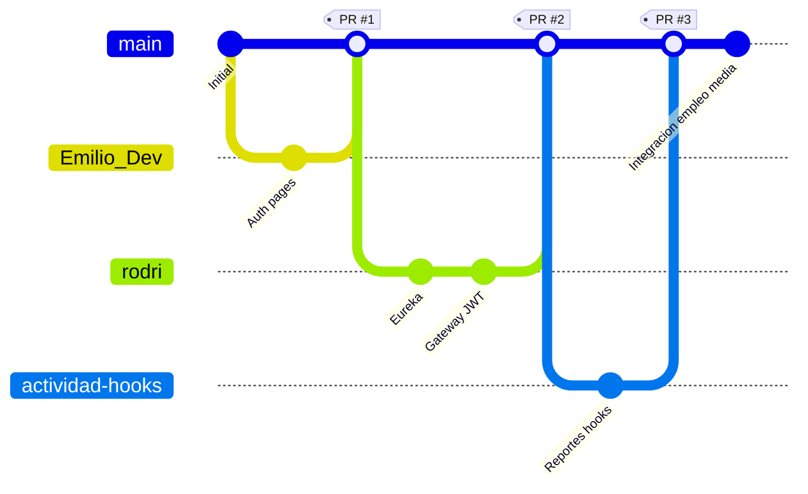
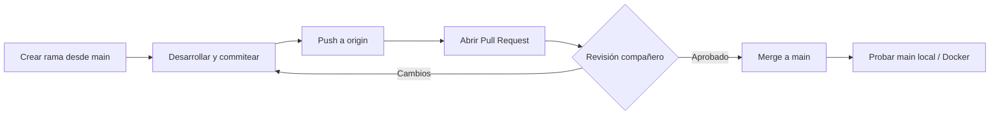

# Plan de Branching — Proyecto S.I.G.I.

**Proyecto:** Municipalidad Valle del Sol  
**Integrantes:** Hawk Durant, Emilio Jaramillo, Rodrigo Candia  
**Repositorio:** `Proyecto-Municipalidad-Valle-del-Sol`  
**Fecha:** Mayo 2026  

---

> **Exportar a PDF:** Abrir en Word o VS Code → *Imprimir > Guardar como PDF*, o:  
> `pandoc docs/PLAN_DE_BRANCHING.md -o docs/PLAN_DE_BRANCHING.pdf --toc`

---

## 1. Objetivo del documento

Definir y registrar la **estrategia de ramas (branching)** que usamos como equipo de tres integrantes para desarrollar el frontend y el backend sin pisarnos el código, integrar por Pull Request y mantener una rama `main` estable para demos y entregas.

Este plan refleja lo que **ya hicimos** en GitHub y lo que **acordamos** seguir hasta el cierre del semestre.

---

## 2. Modelo elegido: GitHub Flow adaptado

No usamos Git Flow completo (sin `develop` ni `release/*` formales) porque el equipo es pequeño y las entregas son continuas al mismo repositorio académico.

Usamos una variante de **GitHub Flow**:

| Rama | Propósito |
|------|-----------|
| `main` | Rama principal, siempre desplegable/demo. Solo entra código revisado. |
| `feature/*` o rama por integrante | Trabajo en curso de una funcionalidad |
| Pull Request (PR) | Revisión entre pares antes de fusionar a `main` |

**Por qué no Git Flow estricto:** ramas `develop` y `hotfix` agregan overhead que en práctica no usábamos; dos integrantes subían PR directo a `main` y funcionó bien con comunicación por WhatsApp/Discord.



---

## 3. Historial real del repositorio (referencia)

Ramas remotas observadas en GitHub:

| Rama | Autoría aproximada | Contenido integrado |
|------|-------------------|---------------------|
| `main` | Equipo | Rama integrada final |
| `Emilio_Dev` | Emilio Jaramillo | Páginas login/registro, Tailwind, React Router (PR #1) |
| `rodri` | Rodrigo Candia | Eureka Server, API Gateway, filtro JWT (PR #2) |
| `actividad-hooks` | Rodrigo Candia / equipo | Vista Reportes, desafío useState/useEffect (PR #3) |

Commits de integración relevantes en `main`:

- `6ad90d3` — Merge PR #1 (`Emilio_Dev`)
- `3ad8409` — Merge PR #2 (`rodri`)
- `eecec11` — Merge PR #3 (`actividad-hooks`)
- `ce88e7e`, `369f10c` — Ajustes formularios y tests unitarios login/register (Hawk)
- Trabajo posterior local — microservicios empleo/media, conexión API (pendiente de merge según estado del repo al entregar)

---

## 4. Convenciones de nombres

### 4.1 Ramas de funcionalidad

Formato recomendado:

```text
<tipo>/<descripcion-corta-en-kebab-case>
```

| Prefijo | Uso | Ejemplo |
|--------|-----|---------|
| `feature/` | Nueva funcionalidad | `feature/servicio-empleo` |
| `fix/` | Corrección de bug | `fix/gateway-jwt-filter` |
| `docs/` | Solo documentación | `docs/informe-patrones` |
| `test/` | Solo pruebas | `test/jest-empleo-service` |

**Alternativa usada al inicio:** rama con nombre del integrante (`Emilio_Dev`, `rodri`). Funcionó al principio, pero para entregas finales preferimos **nombre de feature** para que cualquiera entienda el contenido sin abrir la rama.

### 4.2 Mensajes de commit

Preferimos mensajes en español, imperativo o descriptivo:

- `Creacion API Gateway y filtro JWT`
- `Agrega tests unitarios de login y register`
- `Conecta empleos con servicio-empleo`

Evitamos commits genéricos tipo `fix`, `cambios`, `asdf` en entregas formales.

---

## 5. Flujo de trabajo del equipo

### 5.1 Diagrama del proceso



### 5.2 Pasos detallados

1. **Actualizar `main` local**
   ```bash
   git checkout main
   git pull origin main
   ```

2. **Crear rama de trabajo**
   ```bash
   git checkout -b feature/nombre-descriptivo
   ```

3. **Commits frecuentes** en la rama (unidades lógicas: un endpoint, una página, un fix).

4. **Push**
   ```bash
   git push -u origin feature/nombre-descriptivo
   ```

5. **Pull Request en GitHub** hacia `main`
   - Título claro: qué hace el PR.
   - Descripción: qué probar, capturas si es UI.
   - Asignar revisor: otro integrante que no sea el autor.

6. **Merge** tras aprobación (preferimos *merge commit* o *squash* según el PR; en PR #1–#3 usamos merge estándar de GitHub).

7. **Post-merge:** quien mergeó avisa al grupo; todos hacen `git pull` en `main`.

---

## 6. Reglas del equipo (acuerdos)

| Regla | Razón |
|-------|--------|
| No hacer push directo a `main` en entregas formales | Evita romper la demo del resto |
| Al menos una revisión por PR cuando el cambio toca más de 5 archivos | Calidad y conocimiento compartido |
| Resolver conflictos en la rama feature, no en `main` | Mantiene `main` limpia |
| No subir `.env` con secretos | Usamos `.env.example` |
| Probar `docker compose up` o `npm test` antes del merge si el PR toca backend/frontend crítico | Menos sorpresas en integración |
| Ramas de vida corta (< 2 semanas) | Menos conflictos masivos |

---

## 7. Asignación por integrante (referencia)

| Integrante | Ramas / áreas típicas | Responsabilidad en PR |
|------------|----------------------|------------------------|
| **Hawk Durant** | Login, registro, reporte ciudadano, tests Jest auth | Revisa PRs de UI ciudadana |
| **Emilio Jaramillo** | Cola reportes, emergencias, validación operador | Revisa PRs de flujo operador |
| **Rodrigo Candia** | Gateway, Eureka, dashboard admin, infra Docker | Revisa PRs de infra y admin |

En la práctica, los tres revisamos todo lo que podemos; esta tabla es la **preferencia**, no una exclusión.

---

## 8. Manejo de conflictos

1. En la rama feature:
   ```bash
   git fetch origin
   git merge origin/main
   ```
2. Resolver archivos marcados en el IDE.
3. `git add` + `git commit` del merge.
4. Push y continuar el PR.

Si el conflicto es en `package-lock.json` o `pom.xml`, acordamos regenerar dependencias (`npm install` / `mvn`) en lugar de editar a mano el lock.

---

## 9. Ramas planificadas para cierre del proyecto

| Rama propuesta | Objetivo | Responsable sugerido |
|----------------|----------|----------------------|
| `feature/servicio-empleo-media` | Backend empleo + media + Gateway | Rodrigo + Hawk |
| `feature/frontend-api-integration` | Conexión completa React–Gateway | Hawk |
| `feature/dashboard-mapa` | Mapa admin, validación | Emilio + Rodrigo |
| `docs/entrega-final` | Informes, patrones, branching PDF | Los tres |

Todas fusionan a `main` vía PR cuando Docker y tests pasen.

---

## 10. Tags y releases (opcional)

Para la entrega final podemos etiquetar:

```bash
git tag -a v1.0-entrega -m "Entrega semestral SIGI - Mayo 2026"
git push origin v1.0-entrega
```

Eso facilita al profesor clonar la versión exacta de la defensa sin depender del último commit suelto.

---

## 11. Herramientas

| Herramienta | Uso |
|-------------|-----|
| GitHub | Remoto, PR, issues |
| Git CLI / Cursor / VS Code | Commits locales |
| Docker Compose | Verificar integración en `main` tras merge |

---

## 12. Conclusión

Nuestra estrategia es **simple y alineada con equipos pequeños**: `main` protegida, trabajo en ramas de feature, integración por Pull Request con revisión cruzada. El historial del repo (PR #1 Emilio, PR #2 y #3 Rodrigo, ajustes Hawk en `main`) demuestra que el modelo funcionó para paralelizar frontend temprano e infraestructura backend sin bloquear al resto.

Para la entrega documental, este plan debe leerse junto con el **Informe técnico** (`INFORME_PROYECTO_SIGI.md`) y el **Análisis de patrones** (`ANALISIS_PATRONES_Y_ARQUETIPOS.md`).

---

*Elaborado por Hawk Durant, Emilio Jaramillo y Rodrigo Candia — Mayo 2026.*
